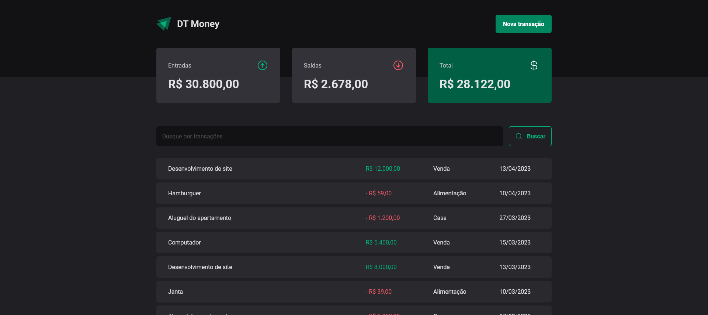

<!-- ===== HEADER (Badges) ===== -->
<p align="right">
  
  <a href="./README.pt-br.md" title="Ler o README em português brasileiro">
    
  </a>
</p>

<h1 align="center">
  <a
    href="https://guipmdev-dt-money.vercel.app/"
    title="Go to the web application"
  >
    
  </a>
</h1>

<p align="center">
  
  
  
  <a
    href="https://github.com/guipmdev/dt-money/commits/main"
    title="View repository commits"
  >
    
  </a>
  <a href="./LICENSE" title="View project license">
    
  </a>
  <a href="https://www.rocketseat.com.br/" title="Go to the Rocketseat website">
    
  </a>
</p>



<p align="center">
  <a href="https://guipmdev-dt-money.vercel.app/"
    >Go to the web application ↗</a
  >
</p>

<details>
  <summary>
    <h2>📒 Table of Contents</h2>
  </summary>

- [📍 Overview](#-overview)
  - [⚠️ Disclaimer](#️-disclaimer)
- [✨ Features](#-features)
- [🤖 Demo](#-demo)
- [🎨 Layout](#-layout)
- [🛠 Technologies](#-technologies)
  - [Website](#website)
  - [Server](#server)
  - [Utils](#utils)
- [🚀 Getting Started](#-getting-started)
  - [✔️ Prerequisites](#️-prerequisites)
  - [📦 Installation](#-installation)
  - [⚙️ Usage](#️-usage)
- [📄 License](#-license)
- [👏 Acknowledgments](#-acknowledgments)
</details>

<!-- ===== PROJECT INFOS ===== -->

## 📍 Overview

The project is a web-based financial application built with _React_ and _TypeScript_. It allows users to manage their transactions by creating, viewing, and searching for transactions. The core functionalities include displaying a summary of income, outcome, and overall balance, creating new transactions, and searching for transactions based on user input.

The purpose of the project is to provide an intuitive and user-friendly interface for managing personal finances, keeping track of transactions, and organizing financial data effectively. Its value proposition lies in its simplicity, efficiency, and the ability to provide important financial insights to users.

### ⚠️ Disclaimer

The back-end of this application is built with _JSON Server_ and does not have a deployment, as the focus is primarily on the front-end. **To fully test the application, you'll need to clone the repository**, run the `dev:server` script, and then open the website.

## ✨ Features

| Feature                        | Description                                           |
| ------------------------------ | ----------------------------------------------------- |
| **➕ Transactions management** | Add your incomes and outcomes.                        |
| **🔎 Transactions search**     | Search your incomes and outcomes by name or category. |
| **📊 Financial summary**       | View summary of income, outcome, and overall balance. |

## 🤖 Demo

https://github.com/guipmdev/dt-money/assets/136738335/a94e2d60-14a9-4139-9715-83c567ad8e9e

## 🎨 Layout

The layout of the application was designed by **Rocketseat** and is available on [Figma](<https://www.figma.com/file/fYmLz2A4boqht18Yjbri9i/DT-Money-(Community)>).

<p align="center">
  
</p>

## 🛠 Technologies

The following tools were used to build the project:

### Website

<p>
  <a href="https://vitejs.dev/">
    
  </a>
  <a href="https://react.dev/">
    
  </a>
  <a href="https://www.typescriptlang.org/">
    
  </a>
  <a href="https://eslint.org/">
    
  </a>
  <a href="https://github.com/rocketseat/eslint-config-rocketseat">
    
  </a>
</p>

<p>
  <a href="https://axios-http.com/">
    
  </a>
  <a href="https://react-hook-form.com/">
    
  </a>
  <a href="https://github.com/colinhacks/zod">
    
  </a>
  <a href="https://github.com/dai-shi/use-context-selector">
    
  </a>
  <a href="https://www.npmjs.com/package/scheduler">
    
  </a>
</p>

<p>
  <a href="https://styled-components.com/">
    
  </a>
  <a href="https://www.radix-ui.com/">
    
  </a>
  <a href="https://phosphoricons.com/">
    
  </a>
</p>

### Server

<p>
  <a href="https://github.com/typicode/json-server">
    
  </a>
</p>

_\* See the [<kbd>package.json</kbd>](./package.json) file_

### Utils

<p>
  <a href="https://git-scm.com/">
    
  </a>
  <a href="https://nodejs.org/">
    
  </a>
  <a href="https://figma.com/">
    
  </a>
  <a href="https://fonts.google.com/">
    
  </a>
  <a href="https://code.visualstudio.com/">
    
  </a>
</p>

## 🚀 Getting Started

### ✔️ Prerequisites

Before you begin, ensure that you have the following tools installed on your machine: [Git](https://git-scm.com/downloads), [Node.js](https://nodejs.org/en/download). It's also good to have an editor to work with the code, such as [VSCode](https://code.visualstudio.com/Download).

### 📦 Installation

1. Clone the repository:

```sh
git clone https://github.com/guipmdev/dt-money/
```

2. Change to the project directory:

```sh
cd dt-money
```

3. Install the dependencies:

```sh
npm install
```

### ⚙️ Usage

1. Start the JSON Server:

```sh
npm run dev:server
```

2. In another terminal, start the web application:

```sh
npm run dev
```

3. Access https://localhost:5173/ (or https://guipmdev-dt-money.vercel.app/) to view the application

## 📄 License

This project is licensed under the terms of the `MIT` license. See the
[LICENSE](./LICENSE) file for additional info.

## 👏 Acknowledgments

> - Many thanks to [Rocketseat](https://www.rocketseat.com.br/) for the layout and tips when putting this project together

<!-- ===== FOOTER ===== -->

---

<p align="center">
  Made with 💙 by
  <a href="https://www.guipm.dev/"> @guipm.dev </a>
  - Feel free to
  <a href="mailto:guipm.dev@gmail.com">contact me</a>!
</p>

<br />

<p align="center">
  <a href="#top">
    <b>↑&nbsp;&nbsp; Return to the top &nbsp;&nbsp;↑</b>
  </a>
</p>
